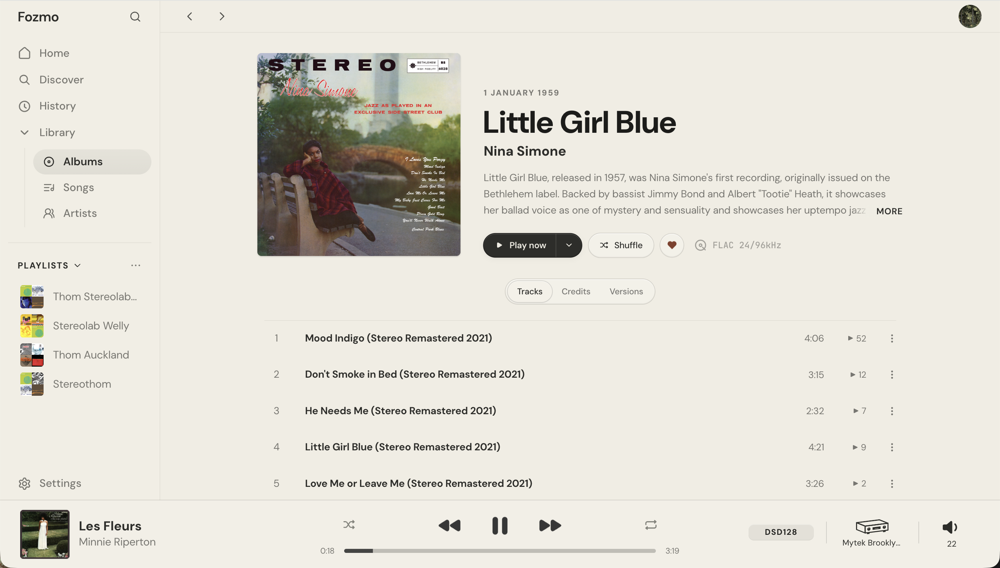

# Fozmo

Fozmo is a local music player with Qobuz streaming functionality, built with Rust and React.

> **Installing Fozmo on a Mac?** Start with the [macOS installation guide](docs/install.md).
> Fozmo 0.0.1 is distributed without Apple Developer ID signing or notarization,
> so its first launch requires approval in macOS Privacy & Security settings.

Fozmo is intended for listeners who already use Qobuz alongside a local music library and want both available through one locally hosted interface.

Fozmo currently works best with a Qobuz subscription for streaming and metadata. The server is designed to run on Apple silicon, ideally something like an M4 Mac mini for the best DSP performance.

Fozmo is currently in pre-alpha. Some parts are useful for daily listening, while others are still experimental or have only been tested on the hardware I have available.

## What Works Best Today

On my current Apple-silicon and USB-DAC setup, the features I have found most reliable are:

- Local-library and Qobuz playback through Core Audio to a USB audio device.
- Basic DSP, including PCM-to-PCM and PCM-to-DSD upsampling.
- A 10-band parametric equalizer.
- Browser-based control.
- Creating and managing playlists.

Qobuz is the most complete streaming path right now. You need your own Qobuz account and subscription. Fozmo is not affiliated with Qobuz.

> **Qobuz notice:** This application uses the Qobuz API but is not certified by Qobuz.

Fozmo also includes experimental implementations for Sonos, AirPlay, Hegel, UPnP, Windows WASAPI/ASIO, and remote agents. These paths have limited hardware coverage and should be treated as test targets rather than compatibility claims.

For more information about the audio processing options, read the [DSP guide](docs/dsp.md).

## Screenshots

### Home


### Album view



### DSP settings


### Outputs


## DSP Starting Point

The setup I currently use is:

```text
Filter:          Smooth Phase
DSD modulator:   7th Order Beam
Headroom:        -2.0 dB
DSD target:      DSD128
```

This is a personal preference, not a quality ranking. Try the available filters and modulators yourself. PCM output is the safer compatibility path and should be used when a DAC, driver, or operating-system route does not have a confirmed DSD path.

The audio system is documented in [docs/dsp.md](docs/dsp.md). The lower-level playback pipeline is documented in [docs/audio-pipeline.md](docs/audio-pipeline.md).

## Platform Status

macOS on Apple silicon is the known-good development platform today. The app can be built and checked elsewhere, but broad platform support should not be assumed from compile coverage alone.

## Future Work

These are the main features I am currently exploring:

- A native iOS app with on-device DSP and offline listening for files from your local Fozmo library. Offline Qobuz and Apple Music playback would not be supported.
- Apple Music support that reroutes hi-res lossless streams from Apple Music on the Mac server to audio devices connected to Fozmo.
- Native SACD support if there is enough interest in the project.

Ideas, bug reports, hardware notes, and feedback are welcome, especially from people testing different DACs, operating systems, libraries, or listening setups.

None of this is promised for the first public release; it is the direction of travel.

## Feedback and development

I'm a first-year university student making Fozmo in my spare time. Fozmo is free and open source, and the public pre-alpha is primarily intended to gather feedback and test the app across a wider range of hardware.

Bug reports, compatibility notes, ideas, and feedback are welcome.

## Setup

### macOS application

The macOS release is an Apple-silicon menu-bar application for macOS 13 or
later. No separate Rust, Node or FFmpeg installation is needed. Because Fozmo
0.0.1 is not signed with an Apple Developer ID or notarized, follow the
[macOS installation guide](docs/install.md) for the first-launch approval
steps and optional command-line setup.

#### Command-line and agent control

The DMG includes the MIT-licensed `fozmoctl` client so local agents and terminal
users can control the running Fozmo server. After installing `Fozmo.app`, expose
the bundled executable as a normal shell command with:

```sh
sudo mkdir -p /usr/local/bin
sudo ln -sf \
  /Applications/Fozmo.app/Contents/Helpers/fozmoctl \
  /usr/local/bin/fozmoctl
```

With Fozmo running, verify the connection on port `3001`:

```sh
fozmoctl doctor
fozmoctl status
fozmoctl zones list
```

Agents can use the repository's [Fozmo DJ agent skill](.agents/skills/fozmo-dj/SKILL.md)
for playback, queue, search, zone and playlist workflows. The recommended
installation method is to give that link to your agent and ask it to install
the skill itself. Agent harnesses use different skill directories and loading
rules, so the agent is best placed to install it correctly. It must also be
allowed to run the local `fozmoctl` command.

An unsigned development DMG can be built on an Apple-silicon Mac with Xcode
26.6 using:

```sh
./macos/scripts/build-dev-dmg.sh
```

Build the normally named, intentionally unsigned 0.0.1 public DMG from a clean
checkout with the pinned toolchains and Gitleaks using:

```sh
./macos/scripts/build-unsigned-release.sh
```

Fozmo 0.0.1 is intentionally released without Developer ID signing,
notarization or automatic updates. The optional future signed-release pipeline
is described in [the packaging guide](docs/packaging.md).

### Source checkout

Use Rust 1.96, Node.js 22 and npm 10, matching the pinned public-release
toolchain, then install the locked frontend dependencies:

```sh
npm --prefix ui ci
```

Build the frontend assets served by the Rust app:

```sh
npm --prefix ui run build
```

Run the app in release mode for listening:

```sh
cargo run --locked --release
```

For local development, the React dev server is available with:

```sh
npm --prefix ui run dev
```

## Running On A LAN

Fresh installations listen on loopback only. To allow trusted-network browsers
to browse and control playback, explicitly enable **Allow LAN Access** in the
macOS menu or pass `--lan`. Run unauthenticated LAN mode only on networks you
trust; the launcher shows a persistent warning while it is enabled. Start the
local core/server on port `3001`:

```sh
cargo run --locked --release -- --port=3001
```

Use `--lan` to opt into trusted-LAN access. A packaged Mac then advertises
both `_fozmo._tcp` and `_http._tcp`, displays
`http://<Mac-LocalHostName>.local:3001`, and offers its raw IPv4 address as a
fallback. Internet-facing Remote Access remains separately authenticated.

Then start an agent and point it at the core/server:

```sh
FOZMO_AGENT_TOKEN=<agent-token> cargo run --locked --release -- --agent --core-url=http://<server-address>:3001
```

Create the agent token on the core machine with:

```sh
curl -X POST http://127.0.0.1:3001/api/agents/token
```

Replace `<server-address>` with the IP address or hostname of the machine running the core/server. LAN mode binds to the network and should only be used on a trusted private network.

On Windows, ASIO support is a build-time feature:

```sh
cargo run --locked --release --features asio -- --agent --core-url=http://<server-address>:3001
```

More detail is available in [docs/lan-pairing.md](docs/lan-pairing.md).

Remote Access for manual router port forwarding is configured from the local
settings UI and is off by default. Read [docs/remote-access.md](docs/remote-access.md)
before exposing a Fozmo server to the internet.

## Verification

Before larger changes, run:

```sh
./tools/verify.sh
```

This runs the frontend checks/build/tests, Rust formatting and checks, Clippy, dependency policy checks, and Rust tests. See [docs/packaging.md](docs/packaging.md) and [docs/manual-smoke-tests.md](docs/manual-smoke-tests.md) before treating a build as release-ready.

CI is the production gate. The `Verify` workflow covers frontend checks,
Playwright smoke and real-server E2E, Swift launcher tests, LAN and remote
smoke tests, Rust quality and cross-platform checks, the standalone AirPlay
helper boundary, dependency policy, and release-native Rust tests. Protect the
public repository's default branch with the required job names documented in
[platform-support.md](docs/platform-support.md), and require branches to be up
to date before merge. Weekly scheduled verification also runs the full
Playwright E2E suite and broader release-native Rust coverage to catch
dependency and platform drift.

## Local Data

Runtime data is created locally and should not be committed or bundled into public artifacts.

Source-checkout data commonly includes:

- `settings.json`
- `settings.local.json`
- `library/`
- `music/`
- local SQLite databases
- service credentials and pairing tokens
- private screenshots or smoke-test notes

Run the public-readiness check before publishing anything:

```sh
./tools/public-readiness.sh
```

More detail is available in [docs/local-data.md](docs/local-data.md), [docs/generated-assets.md](docs/generated-assets.md), and [docs/packaging.md](docs/packaging.md).

## Network and privacy

Fozmo stores your library, playlists, listening history, settings, and related application data locally. It does not include project-operated analytics or telemetry, but Qobuz, metadata, artwork, font, network-output, and Remote Access features can make external or local-network connections.

See [Privacy and network behavior](PRIVACY.md) for the complete service and data-flow overview.

## Qobuz

Fozmo includes an unofficial Qobuz integration for users with their own Qobuz account and active subscription.

This application uses the Qobuz API but is not certified by Qobuz. Qobuz is a trademark of Qobuz. Fozmo is not affiliated with, endorsed by, sponsored by, or certified by Qobuz.

Qobuz audio fetched by Fozmo is used as a temporary playback cache to support reliable streaming. It is not intended for exporting, archiving, sharing, or creating a permanent copy of Qobuz content.

Use of Qobuz through Fozmo remains subject to the [Qobuz Terms of Service](https://www.qobuz.com/us-en/legal/terms).

Documentation and implementation research from the MIT-licensed
[QBZ project](https://github.com/vicrodh/qbz) informed Fozmo's understanding of
the Qobuz API, including adapted web-player token-extraction and request-signing
work. Fozmo's integration is otherwise independently implemented; QBZ did not
author Fozmo. Its upstream copyright and MIT notice are preserved in
[`LICENSES/QBZ-MIT.txt`](LICENSES/QBZ-MIT.txt).

## Fonts And Visual Credits

The interface requests DM Sans and JetBrains Mono from Google Fonts and falls
back to local system fonts when that external service is unavailable; those
fonts are not bundled for offline use. The General settings page lets each
installation upload its own `.ttf` display font, which is stored locally on the
server and served to paired clients on that Fozmo instance.

## Repository Layout

- `src/` — Rust application code.
- `ui/` — React frontend.
- `static/` — built frontend assets served by the Rust app.
- `docs/` — architecture, audio, packaging, and development notes.
- `presets/` — audio preset files.
- `ui/src/styles/` — production design foundations and reusable UI primitives.
- `tools/` — local verification and developer scripts.
- `macos/` — the Swift menu-bar launcher and signed/unsigned DMG tooling.
- `airplay-helper/` — the independent GPL-2.0-only direct-network AirPlay process.
- `crates/fozmo-airplay-protocol/` — the MIT, versioned process protocol.

## License

Fozmo's launcher, server, web client, DSP, documentation, and AirPlay IPC
protocol are released under the MIT License. See [LICENSE](LICENSE) and the
[component map](COMPONENTS.md).

Direct network AirPlay is implemented by the independent
`fozmo-airplay-helper` executable, licensed GPL-2.0-only. It communicates with
the MIT server through a versioned Unix-socket protocol and can list receivers
and play standard PCM/WAV input without Fozmo. The source layout and process
boundary are covered by the scoped 0.0.1 distribution decision in the
[GPL aggregation assessment](docs/gpl-aggregation-assessment.md). Public builds
fail closed if the tracked decision, process boundary, licence notices, or
complete corresponding source are missing. Architectural or distribution
changes listed in that assessment require a new review. See the full
[packaging guide](docs/packaging.md).

Third-party services, trademarks, fonts, album artwork, and other external assets are not relicensed by this repository. Only upload or package fonts you have rights to use.
