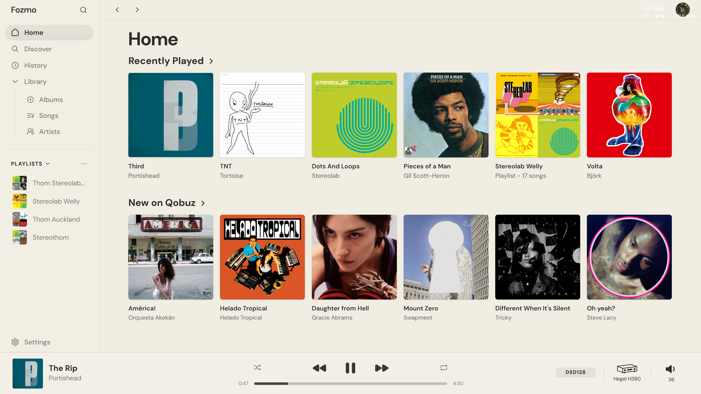
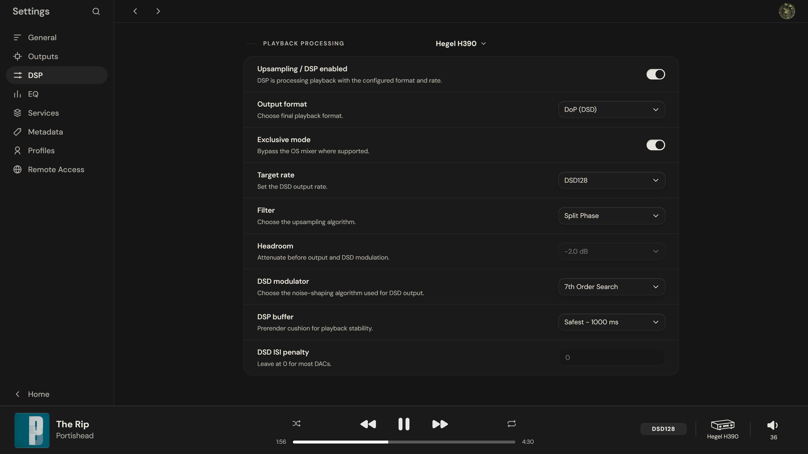
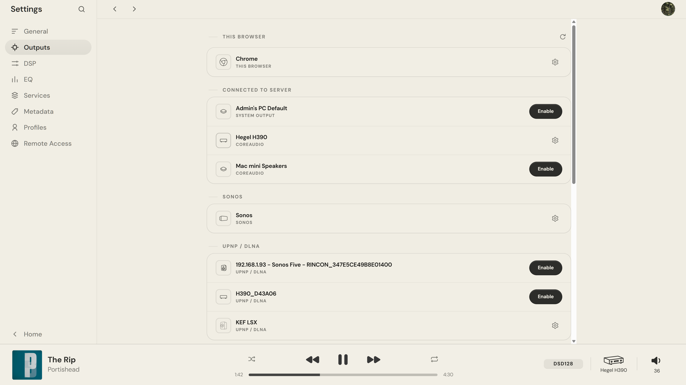

# Fozmo

A local music player that pairs your self-hosted library with Qobuz streaming, built with Rust and React.

> **Pre-alpha:** the known-good setup is macOS on Apple silicon with a USB DAC. Everything else — other platforms, devices, and network outputs — is still experimental.

## Highlights

- Plays your local library and Qobuz through Core Audio.
- Upsamples PCM to PCM, or PCM to DSD.
- Includes a 10-band parametric equalizer.
- Lets you control playback and manage playlists from any browser.
- Offers command-line and agent control through `fozmoctl`.

Qobuz is the most complete streaming path, and you'll need your own account and active subscription to use it. Sonos, AirPlay, Hegel, UPnP, Windows WASAPI/ASIO, and remote agents are all experimental — think of them as test targets rather than compatibility claims.

Curious how the audio side works? Start with the [DSP guide](docs/dsp.md), [audio measurements](docs/Measurements.md), and the [audio pipeline](docs/audio-pipeline.md).

## Screenshots

### Home



### DSP settings



### Outputs



## Install and run

### macOS application

The release ships as an Apple-silicon menu-bar app for macOS 13 or later — no separate Rust, Node, or FFmpeg installation needed.

The current DMG isn't signed with an Apple Developer ID, notarized, or set up for automatic updates yet, so macOS will ask you to approve it on first launch. The [macOS installation guide](docs/install.md) walks you through that, along with the optional command-line setup. If you're interested in how releases come together, see the [packaging guide](docs/packaging.md).

### Source checkout

You'll need the pinned Rust toolchain along with Node.js 22 and npm 10:

```sh
npm --prefix ui ci
npm --prefix ui run build
cargo run --locked --release
```

If you're working on the frontend, run the React dev server separately:

```sh
npm --prefix ui run dev
```

## Command-line and agent control

The macOS DMG bundles the MIT-licensed `fozmoctl` client. Once you've set up the optional shell link from the [installation guide](docs/install.md), you can check on the running server with:

```sh
fozmoctl doctor
fozmoctl status
```

Agents can drive playback, queues, search, zones, and playlist workflows through the repository's [DJ skill](.agents/skills/fozmo-dj/SKILL.md) — they just need permission to run `fozmoctl` locally.

## Network access

Fresh installations listen on loopback only. To open things up to your local network, enable **Allow LAN Access** from the macOS menu, or start a source checkout with `--lan`:

```sh
cargo run --locked --release -- --port=3001 --lan
```

Keep in mind that LAN mode is unauthenticated by default, so only use it on a private network you trust. See [LAN access](docs/lan-pairing.md) for discovery and agent setup.

Internet-facing Remote Access is a separate feature — authenticated, and off by default. Please read the [Remote Access guide](docs/remote-access.md) before forwarding any router port.

## Development

Before larger changes, run the main verification suite:

```sh
./tools/verify.sh
```

And before publishing artifacts or screenshots:

```sh
./tools/public-readiness.sh
```

Release expectations and manual checks live in [platform support](docs/platform-support.md), [packaging](docs/packaging.md), [manual smoke tests](docs/manual-smoke-tests.md), and [local data](docs/local-data.md).

## Privacy

Your library data, playlists, listening history, and settings never leave your machine. The project runs no analytics or telemetry of its own — though Qobuz, metadata lookups, artwork, fonts, network outputs, and Remote Access can naturally make external or local-network connections.

For the full picture of services and data flows, see [Privacy and network behavior](PRIVACY.md).

## Qobuz

The Qobuz integration is unofficial and requires your own account and active subscription. It uses the Qobuz API but is not certified by Qobuz. Qobuz is a trademark of Qobuz, and this project is not affiliated with, endorsed by, sponsored by, or certified by them.

Streamed audio sits in a temporary playback cache purely for reliability — it isn't meant for exporting, archiving, sharing, or keeping a permanent copy. Use remains subject to the [Qobuz Terms of Service](https://www.qobuz.com/us-en/legal/terms).

This integration owes a debt to the MIT-licensed [QBZ project](https://github.com/vicrodh/qbz), whose documentation and implementation research informed it — including adapted web-player token extraction and request signing. The rest was implemented independently; QBZ did not author it. QBZ's upstream copyright and MIT notice are preserved in [`LEGAL/QBZ-MIT.txt`](LEGAL/QBZ-MIT.txt).

## Repository layout

- `src/` — Rust server, playback, library, services, and API code.
- `ui/` and `static/` — React source and built frontend assets.
- `macos/` — Swift menu-bar launcher and DMG tooling.
- `airplay-helper/` and `crates/fozmo-airplay-protocol/` — the standalone AirPlay process and IPC protocol.
- `presets/` — audio presets.
- `docs/` and `tools/` — technical documentation and development scripts.

## License

The launcher, server, web client, DSP, documentation, and AirPlay IPC protocol are all released under the MIT License — see [LICENSE](LICENSE) and the [component map](COMPONENTS.md).

The one exception is direct-network AirPlay, which is provided by the separate `fozmo-airplay-helper` process under GPL-2.0-only. The [GPL aggregation assessment](docs/gpl-aggregation-assessment.md) explains where the distribution boundary sits.

Third-party services, trademarks, fonts, album artwork, and other external assets are not relicensed by this repository — only upload or package assets you have the rights to use.
