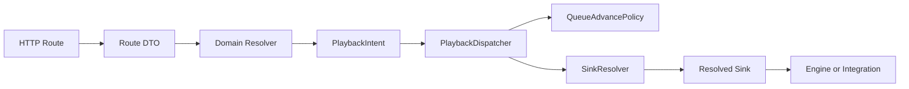
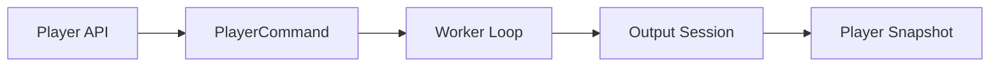
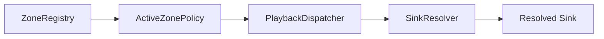

# Architecture

Fozmo is a Rust audio application with a React control UI. The Rust binary
runs an Axum HTTP server, serves the built frontend, scans and stores a local
music library, controls playback, integrates Qobuz, tracks listening history,
and routes audio to local and network outputs.

The codebase is organized around ownership boundaries: startup, HTTP adapters,
product playback orchestration, low-level audio rendering, external
integrations, zone routing, and persistent local data each have separate homes.

## Product Shape

The application supports these output paths:

- Local CoreAudio and CPAL playback on macOS.
- WASAPI and ASIO playback on Windows.
- AirPlay and AirPlay 2 receivers.
- Sonos UPnP speakers.
- Remote LAN agents paired to a core server.

There are two runtime modes:

- `core`: The default mode. Owns the library database, settings, web API,
  React UI, local player, zones, Qobuz, Sonos, AirPlay registry, and LAN
  discovery advertisement.
- `agent`: Started with `--agent` or `FOZMO_MODE=agent`. Connects to a
  LAN core, exposes remote device capabilities, receives playback commands,
  and renders audio on the agent machine.

## Runtime Flow

1. `src/main.rs` delegates to `fozmo::app::run()`.
2. `src/app/runtime.rs` selects core or agent mode, installs diagnostics, and
   coordinates startup.
3. The core resolves workspace paths such as `music/`, `static/`, `presets/`,
   `library/`, and `settings.json`.
4. Startup creates shared services: `SettingsStore`, `Player`, `ZoneManager`,
   `Library`, `ListeningTracker`, `QobuzService`, `AirPlayRegistry`,
   `SonosService`, and `PairingManager`.
5. `api::routes::create_router()` builds API routes and serves
   `static/react-app`.
6. Playback requests become playback intents and flow through
   `PlaybackDispatcher`.
7. The selected zone dispatches to a local player, remote agent, Sonos, UPnP,
   or local-player-backed AirPlay path.
8. The listening monitor polls zone status, records listening history, and
   performs Qobuz auto-advance when configured.

## Dependency Direction

Dependencies should point from adapters and orchestration toward narrower
domain modules. Low-level domains do not import HTTP frameworks or app-global
state.

## Backend Ownership

### App Bootstrap

`src/main.rs` is intentionally tiny. It starts Tokio and delegates to
`fozmo::app::run()`.

`src/lib.rs` owns the crate module tree so startup can be imported and tested as
a library-style application. `src/app/runtime.rs` selects core or agent mode,
installs crash diagnostics, initializes core services, starts background
monitors, and hands the app to the server layer. `src/app/config.rs` owns
environment and CLI parsing. `src/app/bootstrap.rs` constructs shared
`AppState`. `src/app/server.rs` builds the Axum server, attaches middleware,
serves static assets, binds TCP, and advertises LAN discovery. `src/app/auth.rs`
owns pairing middleware. `src/diagnostics/crash.rs` owns panic and native crash
diagnostics.

### App State Ownership

`AppState` is the shared request context used by HTTP adapters and product
orchestration. Low-level audio, persistence, settings models, protocol DTOs,
and external client modules should not depend on it directly.

| Field | Owner Group | Direction |
| --- | --- | --- |
| `settings` | runtime/settings | Persisted app and profile settings. |
| `library` | library | SQLite catalog, queue persistence, history, artwork, and local media. |
| `listening` | playback/listening | Live listening-history state machine and active source tracking. |
| `qobuz` | integrations | Qobuz auth, search, stream resolution, radio, and cache. |
| `airplay` | integrations | Helper-published coarse receiver state and MIT-side IPC facade. |
| `sonos` | integrations | Sonos discovery, stream proxy assets, volume, and transport status. |
| `hegel_status` | integrations | Hegel amplifier status cache and passive poll timing. |
| `zones` | zones/playback routing | Active zone, zone definitions, remote agents, and sink selection. |
| `pairing` | auth/pairing | LAN pairing tokens and route authorization policy. |
| `playback_sequencer` | playback | Client playback command sequence safety. |
| `playback_config_applicator` | playback | Tracks which active-zone playback settings have been applied. |
| `diagnostics` | diagnostics | Process CPU sampling for status responses. |
| `public_base_url` | runtime/server | Public URL for LAN and sink callback/proxy routes. |
| `music_dir` | runtime paths/library adapters | Default local media path used by upload and resolver adapters. |
| `presets_dir` | runtime paths/settings adapters | EQ preset file path used by preset routes. |

### API And Web

`src/api/routes/` owns the HTTP API surface: route registration, route-local
request and response DTOs, playback actions, library endpoints, Qobuz
endpoints, queue endpoints, settings and profile endpoints, zone endpoints,
device lists, Sonos stream endpoints, preset endpoints, and service glue.

Route handlers are grouped by product area. `src/api/routes/mod.rs` owns
top-level route composition and any route families that remain in the aggregate
module. Smaller areas live in sibling modules such as `agents.rs`,
`artwork.rs`, `config.rs`, `devices.rs`, `eq.rs`, `hegel_control.rs`,
`history.rs`, `library_basic.rs`, `library_detail.rs`, `pairing.rs`,
`playback.rs`, `playlists.rs`, `presets.rs`, `profiles.rs`, `queue.rs`,
`streams.rs`, `upload.rs`, `zone_playback.rs`, and `zones.rs`. Qobuz routes
live under `src/api/routes/qobuz/`. WebSocket code stays separate in
`src/web/ws.rs` unless it needs route-local DTOs.

API routes should translate HTTP into domain calls and translate domain results
back into HTTP responses. Playback routes should build or call playback
intents, not directly mutate player internals.

### Playback

`src/playback/` owns product-level playback intent: queue decisions, source
resolution, active-zone routing, now-playing state, service handoff, and
history recording. `playback::intent` defines the command shape used by
playback entry points. `playback::dispatcher::PlaybackDispatcher` owns traced
command entry and common state changes, `playback::queue_advance` owns fallback
policy, and `playback::sinks::SinkResolver` selects the concrete local-player,
Sonos, UPnP, or remote-agent executor. AirPlay playback is represented as a
local-player output path selected by the zone/device layer.

Low-level audio commands stay behind the `Player` API in `src/audio/engine/`.
Local, Qobuz, Sonos, AirPlay, and agent playback requests converge through the
dispatcher instead of branching independently in API routes.

### Audio

The local playback engine lives under `src/audio/engine/`. The public
`Player` API is in `src/audio/engine/player.rs` and is re-exported as
`crate::audio::player` for existing call sites. Internals such as command
dispatch, worker state, queue state, decoding, session startup, render
planning, output opening, PCM/DSD output, worker status, and signal-path
snapshots are split across focused engine modules.

Current ownership split:

- `src/audio/engine/`: Player API, commands, worker state, decoding, seeking,
  queue state, signal-path construction, playback status, and output session
  orchestration.
- `src/audio/dsp/`: PCM resampling, EQ, dither, gain staging, headroom, sample
  conversion support, and metering helpers.
- `src/audio/dsd/`: PCM-to-DSD rendering, delta-sigma modulation, DoP packing,
  native DSD packing, DSD coefficients, and DSD rate selection.
- `src/audio/output/`: Local hardware backends and device controls, including
  CoreAudio hog mode, WASAPI exclusive, ASIO, device capabilities, device
  volume, and sample-format packing.
- `src/audio/sinks/`: Remote and network playback targets such as AirPlay and
  Sonos.

See [audio-pipeline.md](audio-pipeline.md) for the current playback chain.

### Library And History

The local library is SQLite-backed. It handles scanning, metadata, catalog
browsing, album detail assembly, playlists, favorites, listening history, queue
persistence, zone persistence, artwork lookup, and stored media paths.

Important modules:

- `src/library.rs`: Crate-level library facade and shared library methods.
- `src/library/migrations.rs`: Baseline schema setup, FTS setup, additive
  column migrations, and additive playback-history indexes.
- `src/library/albums.rs`: Album detail assembly and album-scoped lookups.
- `src/library/artwork.rs`: Artwork file storage and album art assignment.
- `src/library/artists.rs`: Artist list queries.
- `src/library/tracks.rs`: Track list queries and shared track select SQL.
- `src/library/versions.rs`: Album version lookup, primary-version selection,
  and local-version synchronization.
- `src/library/scanner.rs`: Local music folder scanning and stale-track cleanup.
- `src/library/catalog.rs`: Cross-entity library search.
- `src/library/media.rs`: Artwork bytes, track paths, source refs, and tag
  lookup helpers.
- `src/library/matching.rs`: MusicBrainz/Qobuz metadata scoring and track
  pairing helpers.
- `src/library/musicbrainz.rs`: MusicBrainz candidate search, lookup, preview,
  apply, cover art fetch, and request rate limiting.
- `src/library/metadata.rs`: Local album edit/reset flows and scan metadata
  repair.
- `src/library/playlists.rs`: Playlist CRUD and playlist item serialization.
- `src/library/favorites.rs`: Favorite album persistence.
- `src/library/history_entries.rs`: Playback-history recording, recent history,
  live-entry merging, and per-source playback summaries.
- `src/library/recent_albums.rs`: Recently played album persistence and
  playback-history fallback assembly.
- `src/library/history_summary.rs`: Listening-history aggregate buckets,
  rankings, and recent listened tracks.
- `src/library/history_transfer.rs`: Playback history import and export.
- `src/library/queue_store.rs`: Zone queue and now-playing queue persistence.
- `src/listening.rs`: Listening-history state machine.

Local persistence belongs here. Qobuz-specific matching and sync behavior stay
behind Qobuz service boundaries where database coupling allows it.

### External Services

External integrations include:

- `src/services/qobuz/`: Qobuz login/session handling, token cache, bundle
  token extraction, search, album detail fetching, artist parsing, stream
  resolution and proxying, queue conversion, radio recommendations, cache
  warming, and Qobuz media sources. Public Qobuz DTOs live in `model.rs`, with
  API areas split across focused sibling modules.
- `src/services/hegel/`: Hegel amplifier status/control helpers.
- `src/services/discovery/`: Bonjour/mDNS discovery and advertisement for LAN
  core and agent pairing.
- `src/agent/`: Remote playback endpoint for paired LAN agents, split into
  runtime state, control-loop, stream-source, range-fetch, prefetch,
  capability, and identity modules.

External clients stay separate from route-specific request and response types.

### Zones And Protocol

`src/zones/` manages local and remote zones, pairing tokens, active and enabled
zones, persisted zone settings, remote snapshots, protocol choice, and player
lookup for a zone. `mod.rs` preserves the public surface, while manager,
registry, active-zone policy, agent bridge, capabilities, snapshots, model,
persistence, and pairing behavior live in focused sibling modules.

`src/protocol/` contains shared contracts between core, agents, zones, sources,
sinks, playback, and signal paths. `mod.rs` preserves the `crate::protocol::*`
surface, while focused modules own the serde DTO definitions. These DTOs are
public API shapes as well as Rust types, so field names and optionality should
be reviewed carefully before changing them.

### Settings

`src/settings/` preserves the public settings surface through `mod.rs`, with
focused modules for persisted models, store behavior, profile normalization and
mutation, per-zone playback settings, DSD source rules, and validation.
Settings include profiles, music folders, active zone/profile, per-zone
playback settings, DSD source rules, Hegel settings, and profile defaults.

## Frontend Ownership

The source React app lives under `ui/src`. The production build emits to
`static/react-app`, which is served by Rust.

Current frontend landmarks:

- `ui/src/main.tsx`: React entry point.
- `ui/src/app/`: Application shell, route host, route/chrome composition,
  navigation metadata, and shell effects.
- `ui/src/app/App.tsx`: Top-level composition of app shell, route state,
  feature hooks, playback queue actions, global search, selection state, and
  notices.
- `ui/src/features/`: Product feature views and feature-owned data hooks for
  albums, artists, history, home, library, playback, playlists, Qobuz, search,
  settings, and songs.
- `ui/src/features/playback/`: Playback stores, queue model, control commands,
  zone selection, and playback chrome components.
- `ui/src/shared/lib/`: Shared API helpers, route helpers, formatting, queue
  conversion, theme helpers, and app support utilities.
- `ui/src/shared/ui/`: Reusable UI primitives such as menus, modals, icons, and
  selection toolbars.
- `ui/src/shared/types.ts`: Shared TypeScript DTOs.
- `ui/src/app.css`: Main UI stylesheet.

Frontend structure keeps `ui/src/app/` for shell and route composition, feature
code under `ui/src/features/`, reusable view primitives under
`ui/src/shared/ui/`, and shared DTO/API helpers under `ui/src/shared/`.

## Repo Shape

Keep source and generated/runtime folders distinct:

- `src/`: Rust application source.
- `ui/`: React frontend source and package metadata.
- `static/`: Runtime static assets and built frontend output.
- `ui/src/styles/`: Frontend-owned design foundations and reusable primitives.
- `docs/`: Stable documentation, release notes, architecture notes, and release
  guidance.
- `presets/`: Audio preset JSON files.
- `tools/`: Developer scripts.

## Architecture Guards

`tools/check_architecture_boundaries.py` is part of both `./tools/verify.sh`
and the GitHub Actions verification workflow. It fails on boundaries that are
already established, such as HTTP framework imports in low-level domains,
`AppState` leakage into low-level modules, direct audio-engine internal imports
outside audio, integration-specific behavior in generic playback config, and
direct API fetching from `ui/src/app/App.tsx`.

## Change Guardrails

- Move code by ownership boundary, not by file size alone.
- Prefer one module family per PR or commit.
- Do not combine large file moves with behavior changes.
- Do not delete code that is platform-gated, serde-only, route-only, or
  test-only without call-chain evidence.
- Treat public DTO fields as potentially used by JSON clients even when Rust
  call sites are not obvious.
- Treat route handlers and playback commands as live if they are registered or
  dispatched indirectly.
